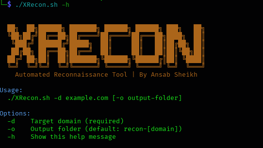

# 🔍 XRecon 
**Automated Subdomain Reconnaissance Tool**

**XRecon** is simple but powerful subdomain enumeration tool built for **bug bounty hunters**, **penetration testers**, and **cybersecurity researchers**.
It automates the process of discovering subdomains and checking which ones are live, helping you save time in recon.

---

Results in single click:
- All found subdomains
- Live subdomains filtered by httpx

---

## 🚀 Why Use XRecon?

- **Beginner-Friendly:** No complex setups. Just run and get results.
- **Accurate Results:** Combines multiple trusted tools like `assetfinder`, `subfinder`, and `httpx`.
- **Saves Time:** Automates enumeration and filtering — no more running tools one by one.
- **Organized Output:** Saves all results in neat folders with separate files for raw and live subdomains.
- **Fast and Lightweight:** Uses passive methods only (safe for stealthy recon).
- 🐱‍💻 **Perfect for Bug Bounty & OSINT Workflows**

---

## 📸 Screenshot



---

## 🛠 Tools Used in XRecon

- [`assetfinder`](https://github.com/tomnomnom/assetfinder) – Passive subdomain discovery
- [`subfinder`](https://github.com/projectdiscovery/subfinder) – Fast and reliable subdomain enumeration
- [`amass`](https://github.com/owasp-amass/amass) – OWASP passive subdomain scanner
- [`httpx`](https://github.com/projectdiscovery/httpx) – HTTP probing for live subdomains

---

## 📦 Installation & Usage

Make sure you have **Go** installed. Then run: 

```bash
git clone https://github.com/mo-ansab/XRecon.git
cd XRecon
bash install.sh
chmod +x XRecon.sh
./XRecon.sh
